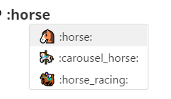
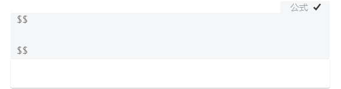
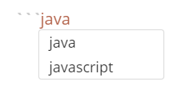
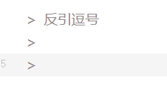

# Typora示例

[TOC]

## 常用快捷键

- ###### 加粗   `Ctrl+B`  `**` `__

- ###### n级标题 `Ctrl+n`  `n个#`

- ###### 插入链接 `Ctrl+K`  [百度链接](www.baidu.com)

- ###### 插入代码  `Ctrl+Shift+K`

- ###### 插入图片  `Ctrl+Shift+I`


##### `emoji表情:`  :microphone: 



##### `块间公式:`$$加换行



##### `代码高亮:`  ``` + 语言



```java
public class ProjectDeviceBranchDto extends ProjectDeviceBranch 
```

`文字高亮:` 	==文字高亮==

##### `反引逗号 `: >
>
> 


##### `插入表格:`  右键 → 插入表格

|      |      |      |
| ---- | ---- | ---- |
|      |      |      |
|      |      |      |
|      |      |      |

#####  `链接引用与脚注：`

**链接引用** [描述]: link  插图[^]

[百度搜索]:www.baidu.com

百度插图[^1]

[^1]: www.123.com


##### `支持HTML` [^html]

[^html]:https://support.typora.io/HTML/

##### `支持CSS` [^css主题]

[^css主题]: https://theme.typora.io/


##### `任务列表`

- [ ]  `- [] `
- [x] `- [X]`

##### `分割线`
`粗线：***` `细线：---`

***

---

##### `上下标`

<sub>:内容<sub>学习</sub>

<sup>:学习<sub>内容</sub>

##### `设置颜色`

**内联公式** ：

$\textcolor{Magenta}{洋红色} $:设置颜色为$\textcolor{RedOrange}{橙红色} $，设置字体颜色为$\textcolor{Blue}{蓝色} $。数学公式里各元素也能分别设置颜色：

$ \textcolor{red}{\int_a^b}\textcolor{blue}{f(x)}\textcolor{green}{dx}\textcolor{brown}{=c}$

**<Html>格式：**

<span style="color:blue;background:yellow;font-size:20px">你要改色的文字</span>


